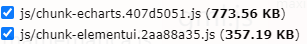

## 代码分包原理

默认情况下，Webpack 会将所有代码构建成一个单独的包，这种将所有资源打包成一个文件的方式存在两个弊端：

+ **「资源冗余」**：客户端必须等待整个应用的代码包都加载完毕才能启动运行，但可能用户当下访问的内容只需要使用其中一部分代码
+ **「缓存失效」**：将所有资源达成一个包后，所有改动 —— 即使只是修改了一个字符，客户端都需要重新下载整个代码包，缓存命中率极低

为此对产物做适当的分解拆包解决，如 `node_modules` 中的资源通常变动较少，可以抽成一个独立的包，那么业务代码的频繁变动不会导致这部分第三方库资源被无意义地重复加载。

-----------------------------

**一句话总结 split chunks：因为第三方库不会经常变动，因此把它们提取出来放在一个入口里，这样这些不经常变动的库单独生成一个打包后的 JS 文件，这有利于使用浏览器缓存，并且提高首屏加载速度。**

----------------------------


## 配置参数说明

+ **chunks**：表示从什么类型的 chunks 里面提取代码。有三个字符串值 initial、async、all。

  +  **aysnc**，是默认值，表示只从动态加载的 chunks 里提取代码。

  + **initial**，表示只从入口 chunks 里提取代码。
  + **all**，表示同时从异步 chunks 和 入口 chunks 里提取代码。

+ **minChunks**：默认值是1，表示拆分前至少被多少个 chunks 引用的模块才会被单独分包。

+ **maxAsyncRequests**：异步加载时的最大并行请求数。默认值为30。本质上是在限制最终产生的分包数量。

+ **maxInitialRequests**：入口点的最大并行请求数。默认值为30。本质上是在限制最终产生的分包数量。

+ **minSize**：超过这个体积的 chunk 才会被分包。默认值是 20000，表示20KB。

+ **cacheGroups**：缓存组。为不同类型的资源设置更有针对性的分包策略。它有几个特有的属性 test、priority、reuseExistingChunk。

  + **priority**：缓存组优先级。若模块命中多个缓存组，则优先被分到 `priority` 更大的组。
  + **reuseExistingChunk**： 复用其他 chunk 内已拥有的模块。当 chunks 引用了已经存在的被抽离的 chunks 时不会新创建一个 chunk 而是复用 chunk。
  + **test**：所有符合 test 判断的 Module 或 Chunk 都会被分到该组。


## 配置参数详解

### minChunks：根据 Module 引用次数分包

通过 `minChunks` 设定按照最小引用次数的分包规则。

需要注意，这里“被 Chunk 引用次数”并不直接等价于被 `import` 的次数，而是取决于引入者是否被视作 Initial Chunk 或 Async Chunk 处理，例如：

~~~js
// common.js
export default "common chunk";

// async-module.js
import common from './common'

// entry-a.js
import common from './common'
import('./async-module')

// entry-b.js
import common from './common'

// webpack.config.js
module.exports = {
  entry: {
    entry1: './src/entry-a.js',
    entry2: './src/entry-b.js'
  },
  // ...
  optimization: {
    splitChunks: {
      // 设定引用次数超过 3 的模块才进行分包
      minChunks: 2
    }
  }
};
~~~


上例包含四个模块，形成如下模块关系图：


`entry-a`、`entry-b` 分别被视作 Initial Chunk 处理；`async-module` 被 `entry-a` 以异步方式引入，因此被视作 Async Chunk 处理。那么对于 `common` 模块来说，分别被三个不同的 Chunk 引入，此时引用次数为 3，命中 `optimization.splitChunks.minChunks = 2` 规则，因此该模块**「可能」**会被单独分包，最终产物：

- `entry-a.js`
- `entry-b.js`
- `async-module.js` 
- `common.js`  **（命中 minChunks 规则，单独分包）**


### maxInitialRequest：限制分包数量

在满足 `minChunks` 基础上，还可以通过 `maxInitialRequest/maxAsyncRequests` 配置项限定分包数量：

- `maxInitialRequest`：用于设置 Initial Chunk 最大并行请求数
- `maxAsyncRequests`：用于设置 Async Chunk 最大并行请求数

“请求数”是指加载一个 Chunk 时所需同步加载的分包数。例如对于一个 Chunk A，如果根据分包规则分离出了若干子 Chunk A¡，如果请求 A 时，浏览器需要同时请求所有的 A¡，那么此时并行请求数等于 ¡ 个分包加 A 主包，即 ¡+1。

举个例子，对于上例所说的模块关系：


若 `minChunks = 2` ，则 `common-1` 、`common-2` 同时命中 `minChunks` 规则被单独打包，浏览器请求 `entry-b` 时需要同时请求 `common-1` 、`common-2` 两个分包，并行数为 2 + 1 = 3，此时若 `maxInitialRequest = 2`，则分包数超过阈值，`SplitChunksPlugin` 会放弃 `common-1` 、`common-2` 中体积较小的分包。


## cacheGroups

除上述 `minChunks`、`maxInitialRequest`、`minSize` 等基础规则外，`SplitChunksPlugin` 还提供了 `cacheGroups` 配置项用于为不同文件组设置不同的规则。

`cacheGroups` 的作用在于能为不同类型的资源设置更具适用性的分包规则，一个典型场景是将所有 `node_modules` 下的模块统一打包到 `vendors` 产物，从而实现第三方库与业务代码的分离。


### 默认分组

`cacheGroups`有两个默认的分组：default 和 defaultVendors。默认配置如下：

~~~js
module.exports = {
  //...
  optimization: {
    splitChunks: {
      cacheGroups: {
        default: {
          idHint: "",
          reuseExistingChunk: true,
          minChunks: 2,
          priority: -20
        },
        defaultVendors: {
          idHint: "vendors",
          reuseExistingChunk: true,
          test: /[\\/]node_modules[\\/]/i,
          priority: -10
        }
      },
    },
  },
};
~~~

在该配置下，所有命中 `defaultVendors.test` 规则的模块都会被视为 `defaultVendors`分组，优先应用该分组下的分包配置。于是最终：

+ 将所有 `node_modules` 中的资源单独打包到 `vendors-xxx-xx.js` 命名的产物 （defaultVendors）
+ 对引用次数大于等于 2 的模块，也就是被多个 Chunk 引用的模块，单独打包 （default.minChunks）


## 在后台管理系统项目中的实践

以后台管理系统项目为例，对使用到的第三方库进行分包：

```json
const IS_PROD = ["production", "prod"].includes(process.env.NODE_ENV);

module.exports = {
  configureWebpack: config => {
    if (IS_PROD) {
      config.optimization = {
        splitChunks: {
          cacheGroups: {
            common: {
              name: "chunk-common",
              chunks: "initial",
              minChunks: 2,
              maxInitialRequests: 5,
              minSize: 0,
              priority: 1,
              reuseExistingChunk: true,
              enforce: true
            },
            vendors: {
              name: "chunk-vendors",
              test: /[\\/]node_modules[\\/]/,
              chunks: "initial",
              priority: 2,
              reuseExistingChunk: true,
              enforce: true
            },
            elementUI: {
              name: "chunk-element-plus",
              test: /[\\/]node_modules[\\/]element-plus[\\/]/,
              chunks: "all",
              priority: 3,
              reuseExistingChunk: true,
              enforce: true
            },
            echarts: {
              name: "chunk-echarts",
              test: /[\\/]node_modules[\\/](vue-)?echarts[\\/]/,
              chunks: "all",
              priority: 4,
              reuseExistingChunk: true,
              enforce: true
            }
          }
        }
      };
    }
  },
  chainWebpack: config => {
    if (IS_PROD) {
      config.optimization.delete("splitChunks");
    }
    return config;
  }
};
```

+ 分包结果：





## 补充：chunk 相关知识


### 分包规则

webpack 会根据模块依赖图的内容组织分包成 Chunk 文件，默认的分包规则有：

- 从 `entry` 入口下依赖的模块共同组织成一个 chunk
- 异步模块单独组织为一个 chunk
- `entry.runtime` 单独组织成一个 chunk


####  Entry 入口分包

在生成阶段，webpack 遍历 entry 属性值，为每一个 entry 单独生成 chunk，之后再根据模块依赖图将 entry 依赖的所有模块打包进 chunk 中。以下列配置为例：

~~~js
module.exports = {
  entry: {
    main: "./src/main",
    home: "./src/home",
  }
};
~~~

Webpack 遍历 entry 对象属性并创建出 `chunk[main]` 、`chunk[home]` 两个对象，此时两个 chunk 分别包含 `main` 、`home` 模块：


初始化完毕后，Webpack 会根据依赖图，将 entry 入口文件的依赖塞入对应的 chunk 中。比如对于如下文件依赖：


main.js 以同步方式直接或间接引用了 a/b/c/d 四个文件，因此最终形成：


**PS：根据 entry  生成的 chunk 包 被称为「Initial chunk」 。**


#### 异步模块分包

分析 模块依赖图 时，每次遇到异步模块都会为之创建单独的 Chunk ，单独打包异步模块。例如对于下面的例子：

~~~js
// index.js, entry 文件
import 'sync-a'
import 'sync-b'

import('async-a')
~~~

在 `index.js` 中，以同步方式引入 `sync-a`、`sync-b`；以异步方式引入 `async-a` 模块；同时，在 async-a 中以同步方式引入 sync-c 模块。对应的模块依赖如：


此时，webpack 会为入口 `index.js`、异步模块 `async-a.js` 分别创建分包，形成如下数据：


上述分包方案默认情况下会生成两个文件：

- 入口 `index` 对应的 `index.js`
- 异步模块 `async-a` 对应的 `src_async-a_js.js`

**PS: 异步模块生成的 chunk ，通常称之为** **「Async chunk」** **。**


