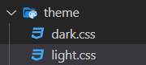

各种换肤本质都是 css 覆盖。

# 方案一：SASS变量+在body上切换class名来更换主题变量

1. 定义多套主题变量

2. 根据主题选择相应的class名


定义多套主题变量：

~~~css
// 浅色
$colors-light: (
  fill-1: #fff,
  text: #3c3c3c,
  text-1: #757575,
  text-2: #222,
);

// 深色
$colors-dark: (
  fill-1: #222,
  text: #fff,
  text-1: rgba(255, 255, 255, 0.3),
  text-2: #ffcd32,
);
~~~


~~~js
// mixin.scss
// 背景色
@mixin bg-color($key) {
  background-color: map-get($colors-light, $key);
  [data-theme="dark"] & {
    background-color: map-get($colors-dark, $key);
  }
}
// text色
@mixin text-color($key) {
  color: map-get($colors-light, $key);
  [data-theme="dark"] & {
    color: map-get($colors-dark, $key);
  }
}
~~~

使用：

~~~css
<style lang="scss" rel="stylesheet/scss">
@import "../../../assets/scss/variable.scss";
@import "../../../assets/scss/mixin.scss";
.reaconmend-list {
    .list-title {
      height: 40px;
      line-height: 40 px;
      text-align: center;
        @include text-color(text-1);
    }
}
</style>
~~~


# 方案二： 预备多套CSS主题

1. 将样式拆分成 `ligth.css` 和 `dark.css` 两个文件

   

2. 通过 js 控制外联样式表的href属性值切换主题样式

```html
<link id="theme-link" href="light.css" rel="stylesheet" type="text/css">
```


~~~js
export default function setTheme(theme = 'light') {
  let link = document.querySelector('#theme-link')
  let href = "/theme/" + theme + ".css"
  
  if (!link) {
    let head = document.querySelector('head')
    link = document.createElement('link')
    link.id = '#theme-link'
    link.rel = "stylesheet"
    link.href = href
    head.appendChild(link)
  } else {
    link.href = href
  }
}
~~~

缺点：

+ 需要手写多套 css 样式代码
+ 需要提前知道打包后的文件路径
+ 更换主题需要下载新的 css 样式代码


# 方案三：CSS变量+在body上切换class名来更换主题变量

css 变量换肤的核心是修改 css变量的值。

为了方便，通过修改选择器来统一修改里面包含的所有变量值。

+ 定义好不同主题的样式变量对应的类选择器
+ 通过切换类选择器名切换主题

~~~css
/* 默认 light 主题 */
:root {
  --width: 100vw;
  --height: 100vh;
  --bg: green;
  --color: #333333;
}

.pink-theme {
  --bg: hotpink;
  --color: white;
}

.dark-theme {
  --bg: #333333;
  --color: white;
}
~~~

手动修改样式：

~~~js
import { createStore } from 'vuex'

const store = createStore({
  state () {
    return {
      theme: ''
    }
  },
  mutations: {
    setTheme (state, theme) {
      state.theme = theme
    }
  }
})

export default store
~~~


~~~js
watch(()=> store.state.theme, (newTheme, oldTheme) => {
  document.body.classList.remove(oldTheme);
  document.body.classList.add(newTheme);
})

//实现二：
Object.keys(themeOption).forEach((key)=> {
  document.body.style.setProperty(key, themeOption[key]);
})

//实现三：
document
  .getElementsByTagName("body")[0]
  .setAttribute("data-theme", "dark");
~~~


