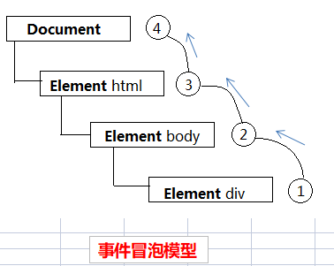

事件委托利用事件冒泡，可以只使用一个事件处理程序来管理一种类型的事件。

例如，click 事件冒泡到 document。这意味着可以为整个页面指定一个 onClick 事件处理程序，而不用为每个可点击元素分别指定事件处理程序。

使用事件委托能有效解决下列问题：

- 绑定事件越多，浏览器内存占用越大，严重影响性能
- 只指定一个事件处理程序，节省花在设置页面事件处理程序上的时间
- 重复绑定，会导致代码的耦合性过大，严重影响后期的维护