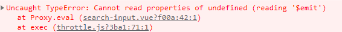

最开始将防抖写在 watch 内部，然后发现防抖功能没有生效。

~~~js
watch: {
  query(newQuery) {
    debounce(300, () => {
      this.$emit("update:modelValue", newQuery.trim());
    });
  }
}
~~~

经过排查之后，发现是在数据改变之后，我们只执行了debounce方法，实际上需要执行的是debounce 方法返回的函数。于是，我改成 handler 的写法，把 debounce 函数调用写成 handler 的属性值，以此拿到 debounce 返回的函数：

~~~js
watch: {
  query: {
    handler: debounce(300, () => {
      this.$emit("update:modelValue", newQuery.trim());
    }),
  },
},
~~~

但这时候虽然防抖功能可以正常运行了，但又出现了新的问题，控制台中报错说不能读取到 undefined 属性：

接着我尝试打印 `this`，发现打印出来的是 undefined：

而我期望的是`this`指向的是当前组件的实例对象。根据 this 指向的知识进行分析，函数内的 this 一般是指向的是调用当前函数的对象，而这个对象即使在作用域最外层也会打印出 **window** 对象。但是在严格模式下，作用域的最外层的 **this** 打印出来的是`undefined`。同时 vue 的代码经过 babel 编译转化为 ES5 代码的时候会添加 `use strict`，声明为严格模式。

因此，可以判断出这个函数应该是处于全局作用域下的调用的。

判断出原因后马上就发现自己写的代码为了精简使用了箭头函数，而箭头函数因为没有自己的执行上下文也就没有自己的 this 指针，如果在箭头函数中访问 this，那么就会在外层找，因此就找到了 全局对象，（ 比如`vue.() => { this }`类似这种调用，最终会找到了全局对象 ），并且在严格模式下变成了 undefined。

debounce 方法实际上是调用定时器来执行回调，因此回调异步执行，最终在vue实例的上下文中调用。

因此，最终将回调由箭头函数的形式修改成匿名函数的形式解决了这个问题。

~~~js
watch: {
  query: {
    handler: debounce(300, function (newQuery) {
      this.$emit("update:modelValue", newQuery.trim());
    }),
  },
  modelValue(newVal) {
    this.query = newVal;
  },
},
~~~

---------------

按官网的说法，在 created 生命周期里添加防抖函数：

~~~js
created() {
  this.$watch(
    "query",
    debounce(300, (newQuery) => {
      this.$emit("update:modelValue", newQuery.trim());
    })
  );
  this.$watch("modelValue", (newVal) => {
    this.query = newVal;
  });
},
~~~

