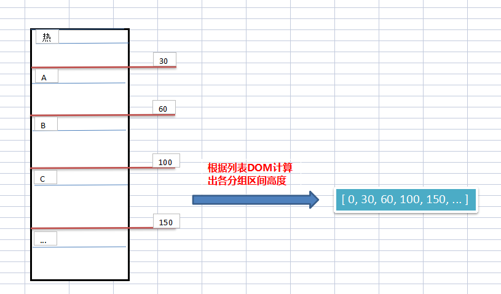

## 滚动标题原理

1. 利用 CSS 层级，设置一个固定遮罩层。

2. 根据列表 DOM 计算出各分组区间的高度。

   

3. 然后监听滚动事件，根据滚动坐标判断当前落入的区间，从而获得相关数据完成固定遮罩层的文字渲染。

### 实现细节

1. 计算分组区间高度

~~~js
function calculate() {
  const list = groupRef.value.children;
  const listHeightsVal = listHeights.value;

  let height = 0;
  listHeightsVal.length = 0;
  listHeightsVal.push(height);

  for (let i = 0; i < list.length; i++) {
    height += list[i].clientHeight;
    listHeightsVal.push(height);
  }
}
~~~

2. 监听滚动

~~~js
watch(scrollY, (newY) => {
  const listHeightsVal = listHeights.value;
  for (let i = 0; i < listHeightsVal.length - 1; i++) {
    // 获取每个分组的高度
    const heightTop = listHeightsVal[i];
    const heightBottom = listHeightsVal[i + 1];
    // 进而判断落入的区间
    if (newY >= heightTop && newY <= heightBottom) {
      currentIndex.value = i;
      /* 计算当前分区底部与容器顶部的距离，用于后续上推优化 */
      distance.value = heightBottom - newY;
      break;
    }
  }
});
~~~

3. 根据滚动落入区间获得数据信息

~~~js
const fixedTitle = computed(() => {
  // 获取 title 值
  const currentGroup = props.data[currentIndex.value];
  return currentGroup ? currentGroup.title : "";
});
~~~

## 吸顶合并原理

1. 结合上面得到的分组区间高度信息，可以获知当前滚动位置距离下一个分组顶部的距离。当这个距离小于固定标题栏的高度时，即触发吸顶合并。
2. 该效果的实现其实是**同步移动固定标题栏**，并且父容器设置 “overflow: hidden” 从而视觉上形成**“吸顶合并”**。

### 实现细节

判断滚动标题与固定标题是否接触，接触则同步移动。

~~~js
const fixedStyle = computed(() => {
  const distanceVal = distance.value;
  const diff =
        distanceVal > 0 && distanceVal < TITLE_HEIGHT
  ? distanceVal - TITLE_HEIGHT
  : 0;
  return {
    transform: `translate3d(0, ${diff}px, 0)`,
  };
});
~~~

