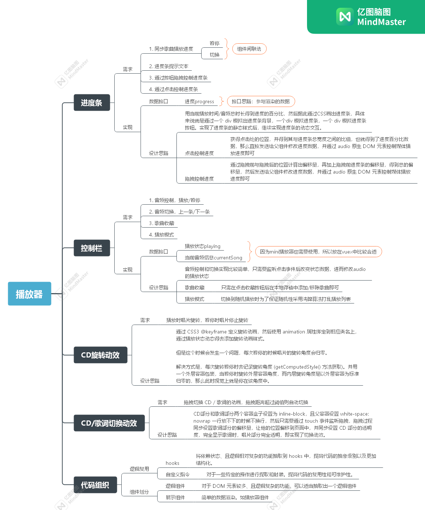

难点。组件设计、状态管理、组件联动等

## 组件划分

> **组件划分可以分为逻辑组件和页面组件**

1. 逻辑组件

> 逻辑组件：组件的逻辑、交互太多，适当的拆分。如播放器组件里的进度条组件

2. 展示组件

> 展示组件：简单的数据渲染。如播放器组件

------------

音频播放器部分由以下几个功能组成：

+ 播放/暂停
+ 音频播放时长显示
+ 进度条 - 播放进度显示与跳转
+ 音频切换 - 上一条/下一条
+ 歌曲收藏

## audio 原生属性

| 属性            | 解释               |
| --------------- | ------------------ |
| currentTime     | 当前音频播放的时间 |
| duration (只读) | 当前音频播放总时长 |

## audio 原生方法

| 方法    | 解释     |
| ------- | -------- |
| play()  | 播放开始 |
| pause() | 播放暂停 |

## audio 原生事件

| 事件       | 解释                                                         |
| ---------- | ------------------------------------------------------------ |
| timeupdate | timeupdate的触发条件是当currentTime发生更新时， 主要用来获取实时的currentTime |
| ended      | 播放到结束位置时，播放停止并触发事件                         |
| pause      | 播放暂停时触发                                               |

## 进度条

播放器进度条由三部分组成：

+ btn：通过 div 模拟一个滑动控件
+ progress：通过 div 动态设置宽度模拟当前播放进度
+ bar-inner：通过 div 设置宽度模拟完整进度条

### 原理

+ 获取当前的播放时间（currentTime）和音频总时长（duration）
+ 将这二者的比例使用元素和样式模拟出进度条

### 实现

1. 获取到音频 [ 播放时间 ] 和 [ 视频总时长 ] 的比例：

~~~js
// 播放时间和视频总时长的比例即为播放进度
const progress = computed(() => {
  return currentTime.value / currentSong.value.duration
})
~~~

2. 接着使用元素和样式来模拟进度条。

   + 首先通过传入播放进度参数 progress 动态计算出进度条的宽度

     ~~~js
     setOffset(progress) {
       const barWidth = this.$el.clientWidth - progressBtnWidth
       this.offset = barWidth * progress
     }
     ~~~

   + 设置相应的样式

     ~~~js
     computed: {
       progressStyle() {
         return `width: ${this.offset}px`
       },
       btnStyle() {
         return `transform: translate3d(${this.offset}px, 0, 0)`
       }
     },
     ~~~

     

   

​		

## 进度条拖拽

[移动端拖拽实现方案](./移动端拖拽实现方案.md)

bug：拖拽完成后闪烁回原位

原因：拖拽是会对 currentTime 的值进行修改，而 timeupdate 的监听事件也会对该值进行修改，而播放进度样式与 currenTime 值息息相关，因此会出现进度条闪烁的情况。

解决：因此该bug的解决方法就是设定一个拖拽的标志位来控制 timeUpdate 的监听事件即可。

~~~js
function updateTime(e) {
  if (!progressChanging) {
    currentTime.value = e.target.currentTime
  }
}
~~~

## 进度条点击跳转

思路：

+ 获取点击处（e.pageX）与左边界的距离（getBoundingClientRect()），由此计算出当前进度条宽度
+ 该宽度与整体的比例即播放进度

~~~js
onClick(e) {
  const rect = this.$el.getBoundingClientRect()
  const offsetWidth = e.pageX - rect.left
  const barWidth = this.$el.clientWidth - progressBtnWidth
  const progress = offsetWidth / barWidth
  this.$emit('progress-changed', progress)
},
~~~

------------

## CD唱片旋转

通过 CSS3 @keyframe 定义旋转动画，然后使用 animation 属性绑定到相应类名上，通过播放状态动态得设置旋转动画，达到播放时唱片旋转，暂停时唱片停止旋转的目标。

但是这个时候会发生一个问题，每次暂停的时候唱片的旋转角度会归零。

解决方式是，每次旋转暂停时去记录旋转角度 (getComputedStyle() 方法获取)。并用一个外层容器包裹，当暂停时旋转外层容器角度，而内层旋转角度是以外层容器为标准归零的，那么此时视觉上就是停在该角度中。

-----------------

## 洗牌算法

~~~js
/**
 * @description: 遍历数组，每次取[i, n-1]闭区间的一个随机数nums[rand]，交换nums[i]和nums[rand]即可
 */
export function shuffle(source) {
  const arr = source.slice()
  let n = arr.length
  for (let i = 0; i < n; i++) {
    const j = getRandomInt(i, n - 1)
    swap(arr, i, j)
  }
  return arr
}

function getRandomInt(n, m) {
  return Math.floor(Math.random() * (m - n + 1)) + n
}

function swap(arr, i, j) {
  const t = arr[i]
  arr[i] = arr[j]
  arr[j] = t
}
~~~

