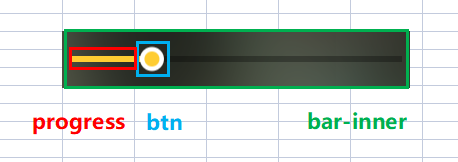
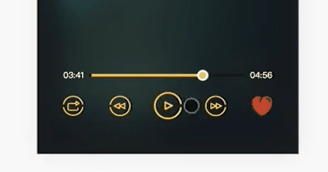
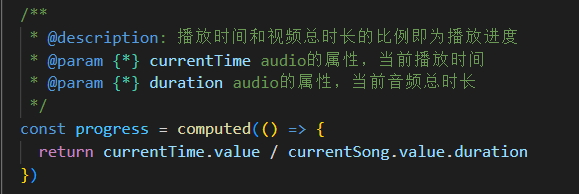

音频播放器部分由以下几个功能组成：

+ 播放/暂停
+ 音频播放时长显示
+ 进度条 - 播放进度显示与跳转
+ 音频切换 - 上一条/下一条
+ 歌曲收藏

## audio 原生属性

| 属性            | 解释               |
| --------------- | ------------------ |
| currentTime     | 当前音频播放的时间 |
| duration (只读) | 当前音频播放总时长 |

## audio 原生方法

| 方法    | 解释     |
| ------- | -------- |
| play()  | 播放开始 |
| pause() | 播放暂停 |

## audio 原生事件

| 事件       | 解释                                                         |
| ---------- | ------------------------------------------------------------ |
| timeupdate | timeupdate的触发条件是当currentTime发生更新时， 主要用来获取实时的currentTime |
| ended      | 播放到结束位置时，播放停止并触发事件                         |
| pause      | 播放暂停时触发                                               |

## 进度条

播放器进度条由三部分组成：

+ btn：通过 div 模拟一个滑动控件
+ progress：通过 div 动态设置宽度模拟当前播放进度
+ bar-inner：通过 div 设置宽度模拟完整进度条

### 原理

+ 获取当前的播放时间（currentTime）和音频总时长（duration）
+ 将这二者的比例使用元素和样式模拟出进度条

### 实现

1. 获取到音频 [ 播放时间 ] 和 [ 视频总时长 ] 的比例：

~~~js
// 播放时间和视频总时长的比例即为播放进度
const progress = computed(() => {
  return currentTime.value / currentSong.value.duration
})
~~~

2. 接着使用元素和样式来模拟进度条。

   + 首先通过传入播放进度参数 progress 动态计算出进度条的宽度

     ~~~js
     setOffset(progress) {
       const barWidth = this.$el.clientWidth - progressBtnWidth
       this.offset = barWidth * progress
     }
     ~~~

   + 设置相应的样式

     ~~~js
     computed: {
       progressStyle() {
         return `width: ${this.offset}px`
       },
       btnStyle() {
         return `transform: translate3d(${this.offset}px, 0, 0)`
       }
     },
     ~~~

     

   

​		

## 进度条拖拽

[移动端拖拽实现方案](./移动端拖拽实现方案.md)

bug：拖拽完成后闪烁回原位

原因：拖拽是会对 currentTime 的值进行修改，而 timeupdate 的监听事件也会对该值进行修改，而播放进度样式与 currenTime 值息息相关，因此会出现进度条闪烁的情况。

解决：因此该bug的解决方法就是设定一个拖拽的标志位来控制 timeUpdate 的监听事件即可。

~~~js
function updateTime(e) {
  if (!progressChanging) {
    currentTime.value = e.target.currentTime
  }
}
~~~

## 进度条点击跳转

思路：

+ 获取点击处（e.pageX）与左边界的距离，由此计算出当前进度条宽度
+ 该宽度与整体的比例即播放进度

~~~js
onClick(e) {
  const rect = this.$el.getBoundingClientRect()
  const offsetWidth = e.pageX - rect.left
  const barWidth = this.$el.clientWidth - progressBtnWidth
  const progress = offsetWidth / barWidth
  this.$emit('progress-changed', progress)
},
~~~

